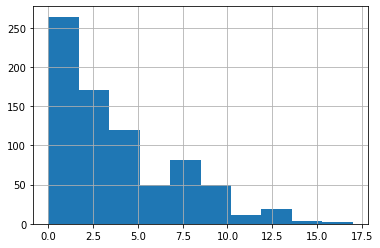
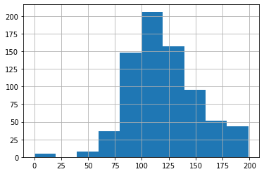
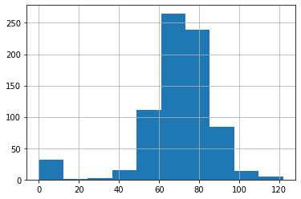
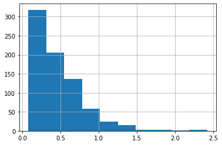
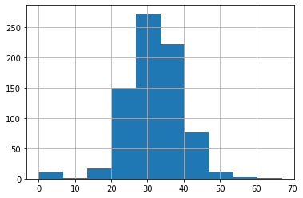
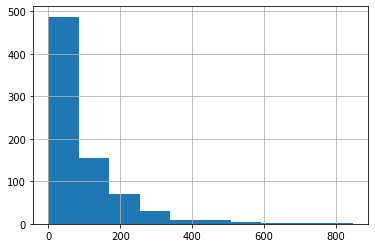
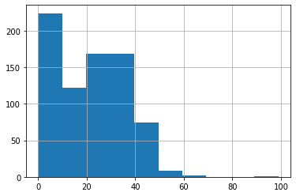
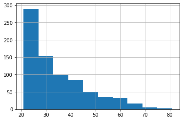

# ML-model-for-Diabetes.

A machine learning model to classify whether patients in a dataset have diabetes.

## Problem Statement
Given a dataset of patients' information, predict whether a patient has diabetes.

## Dataset
The dataset is called "Pima_Indian_Diabetes" and is provided in the form of a csv file. It has 9 columns featuring pregnancies, glucose level, blood pressure, skin thickness, insulin, BMI, diabetes pedigree function, age and the outcome (diabetic or not), and records of more than 750 patients for each of the columns.

The histograms shown are in the following order : Pregnancies, Glucose, BloodPressure, Diabetes Pedigree Function, BMI, Insulin, Skin thickness and age.

<p align="center">
  
  
  
  
  
  
  
  

</p>

## Installation Requirements
```
pip3 install numpy
pip3 install pandas
pip3 install scikit-learn 
```

## Data Preprocessing
We added a new column named "Patient_ID" for patient classification.

The provided dataset had a lot of missing values or NULL values. It could be because of one of the two reasons : either the value wasn't recorded or it doesn't exist at all.

### Pregnancies
For the NULL values in this column, we can assume those patients to be male and fill them with 0s.

### All other columns
The NULL values in all the other columns were filled according to a scheme - 
- For any NULL value of any patient, if the patient was given to be **diabetic**, then the NULL value will be replaced by the *mean value* of that column corresponding only to the **diabetic** patients.
- Similarly, for any NULL value of any patient, if the patient was given to be **non-diabetic**, then the NULL value will be replaced by the *mean value* of that column corresponding only to the **non-diabetic** patients.

The histograms shown are in the following order : Pregnancies, Glucose, BloodPressure, Diabetes Pedigree Function, BMI, Insulin, Skin thickness and age.

<p align="center">
  
  
  
  
  
  
  
  
</p>

## Model building
- The features that we use are pregnancies, glucose level, blood pressure, skin thickness, insulin, BMI, diabetes pedigree function, age with the target being the outcome.
- We then split the dataset into training and testing subsets in the ratio of 0.3
- Since the target outcome can only have either 0 or 1 as its value, we apply logical regression over the feature vector for a 100 different shuffles of the data.
- We then fit our training data on the logmodel and use the predict function in scikit-learn to predict the outcome on the test data.
- We also use the accuracy measuring tools of scikit-learn to measure the accuracy of our model.
- Running instructions :
```
python3 Model.py
```
- The final accuracy comes out to be : 
    - Maximum accuracy : 84.84%
    - Mean accuracy : 76.32% 

## Contributors
- Gandharv Suri : IMT2017017
- Advait Lonkar : IMT2017002
- Mili Goyal : IMT2017513


